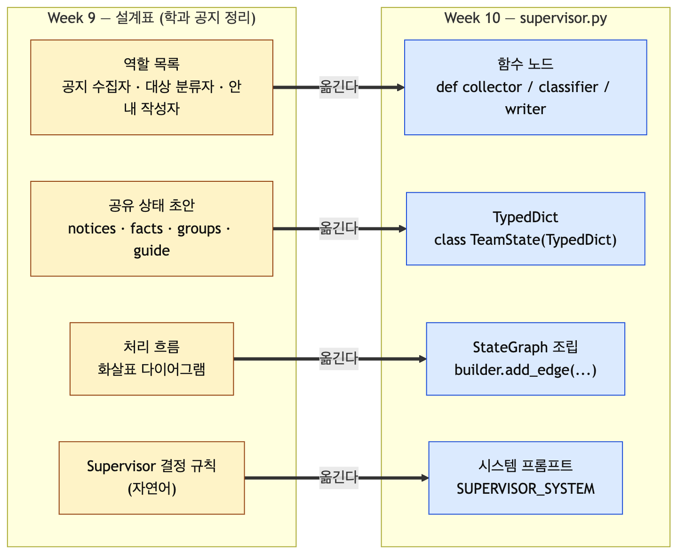
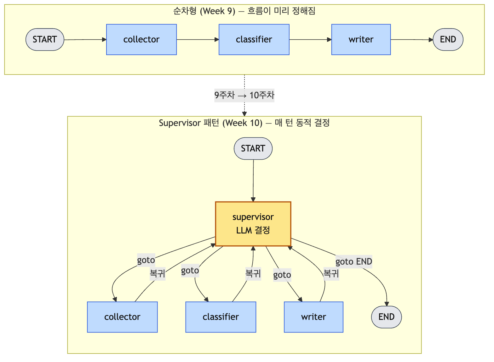
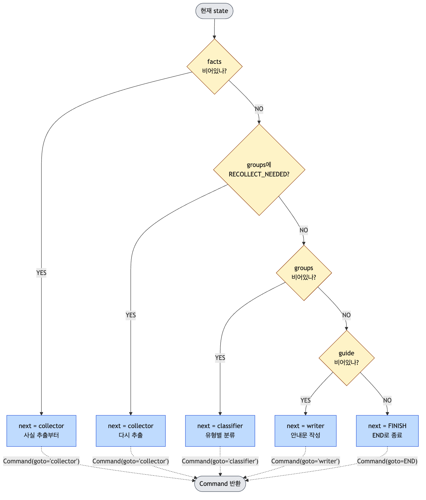
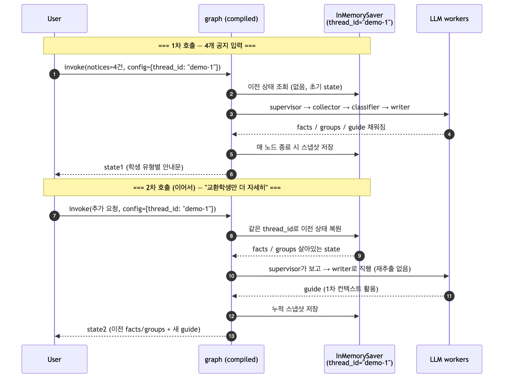
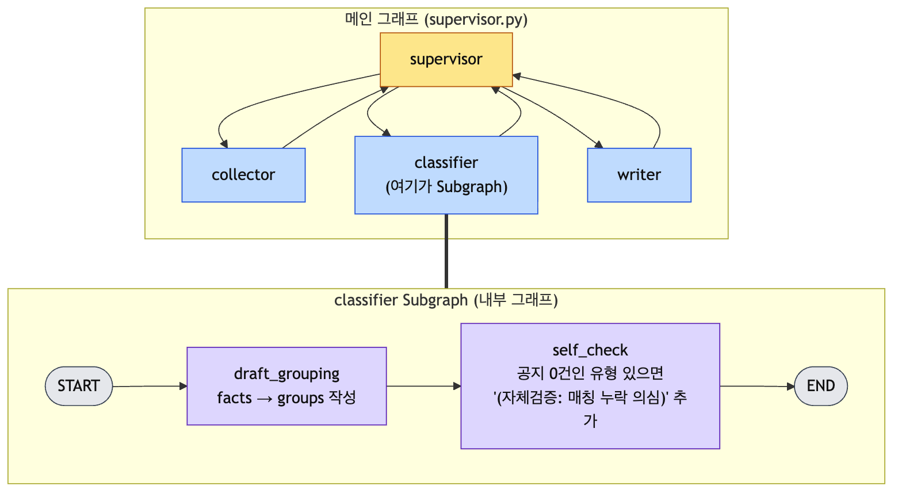
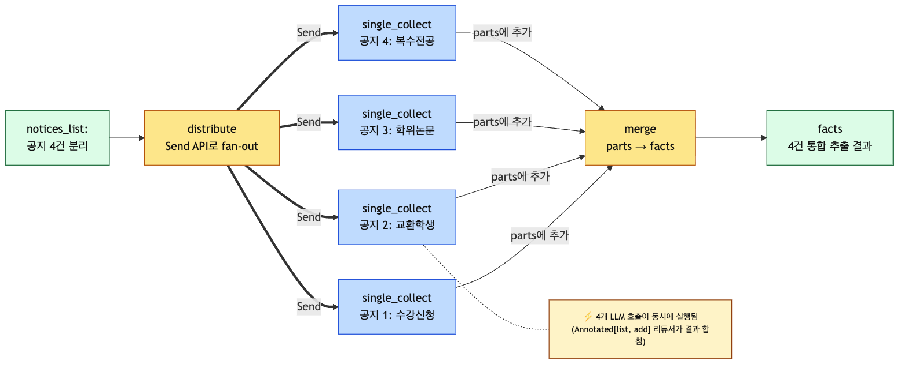

# Week 10. LangGraph 멀티에이전트 실습 1: Supervisor (= Orchestrator) — 바이브코딩

> 강의 + 수업 Supervisor 구현 실습 + Homework 변형 과제
> **방침**: 학생이 코드를 *직접 작성*하지 않는다. AI(Copilot·Claude·Antigravity)에 시켜 받은 코드를 *읽고 검증*한다. 핵심 코드 3덩어리만 본다.
> 참조: 9주차 설계표, LangGraph 1.0 (2025-10 GA), Anthropic 「How we built our multi-agent research system」(2025)

> **📖 다른 형식으로 보기**
> 본 자료의 다이어그램(Mermaid → PNG)은 GitHub에서 인라인으로 보인다. PDF·HTML 변환본은 다음 명령으로 생성한다.
> ```bash
> cd class && ./build.sh week-10
> # → class/week-10.html (단일 파일, 다이어그램 base64 임베드 — 더블클릭으로 열림)
> # → class/week-10.pdf  (Chrome headless 렌더, 다이어그램 포함)
> ```
> *PDF에 그림이 안 보이면* `class/week-10.html`을 브라우저로 열면 모든 다이어그램이 정상 렌더된다. HTML은 단일 파일이므로 어디서든 열린다.

> **용어 안내 — Supervisor = Orchestrator**
> 이 패턴의 *관리자 역할*은 문헌마다 이름이 다르다. 본 강의는 두 용어를 같은 의미로 쓴다.
>
> | 출처 | 용어 |
> |---|---|
> | LangGraph 공식 (`langgraph-supervisor` 패키지, "Agent Supervisor" 튜토리얼) | **Supervisor** |
> | Anthropic 「How we built our multi-agent research system」(2025) | **Orchestrator** (orchestrator-worker pattern, lead agent) |
> | Microsoft Magentic-One | Orchestrator |
> | CrewAI / AutoGen | Manager / Lead Agent |
>
> 본문에서는 *코드와 매칭하기 위해* `Supervisor`를 기본 표기로 쓰되, 개념을 강조할 때는 "Supervisor (= Orchestrator)"로 병기한다. 함수명·파일명·`langgraph-supervisor` 패키지명은 LangGraph 공식 용어를 따른다.

---

## 학습 목표

- 9주차에 만든 *설계표*를 LangGraph **Supervisor 코드**로 옮긴다
- Supervisor가 "다음에 누가 일할지"를 **LLM이 결정**한다는 걸 직접 본다
- `Command(goto=...)` 한 줄이 9주차에서 말한 **핸드오프**라는 걸 확인한다
- **Checkpointer**로 두 번째 질문이 이전 대화를 이어받는 걸 본다
- 콘솔 라우팅 로그로 Supervisor의 *동적 결정*을 추적한다 (관측 도구는 13주차에서 도입)

---

## 이번 주 핵심 원칙 (바이브코딩 모드)

1. **코드를 작성하지 않는다, 시킨다.** Copilot Chat 또는 Claude Code에 프롬프트를 넣고 받은 코드를 그대로 쓴다.
2. **세 덩어리만 직접 읽는다.** ① 상태(TeamState) ② Supervisor 라우팅 ③ 그래프 조립.
3. **돌아가는 것부터 본다.** 30분 안에 답이 나오는 supervisor 1개를 만들고, 그 다음에 동적 라우팅을 더한다.
4. **9주차 설계표가 코드의 골격**이다. 역할 = 노드, 공유 상태 = TypedDict 필드, 흐름 = edge.
5. *Subgraph·Send API*는 "심화 도전"으로 분리. 본 흐름에 넣지 않는다.

---

## 10.1 9주차 설계표가 어떻게 코드가 되는가



| 9주차 설계표 항목 | 10주차 코드 위치 |
|---|---|
| 역할 (예: 연구자, 분석가, 작성자) | 함수 노드 `researcher` `analyst` `writer` |
| 공유 상태 (예: question, research, draft) | `TeamState(TypedDict)` 필드 |
| 처리 흐름 화살표 | `builder.add_edge(...)` |
| Supervisor가 "어디로 보낼지" 판단 | `Command(goto="...")` |
| 사람 승인 지점 | (이번 주는 생략, 13주차에서 추가) |

**학생이 할 일**: 자신의 9주차 설계표를 펴 놓고, 같은 흐름을 supervisor 패턴으로 변형한다.

---

## 10.2 Supervisor (= Orchestrator) 패턴 한 줄 요약



- 순차형(9주차)은 흐름이 *미리 정해져* 있다 — 연구자 → 분석가 → 작성자.
- Supervisor 패턴(10주차)은 매 턴마다 supervisor(= orchestrator, LLM)가 *다음 노드를 동적으로* 고른다.
- 작업자는 끝나면 *반드시* supervisor로 돌아간다 (다음 분기는 supervisor가 다시 정한다).
- 모든 작업이 끝났다고 supervisor가 판단하면 `END`로 보낸다.

분석가가 "정보가 부족하다"고 하면 다시 연구자로 돌릴 수 있는 게 핵심 차이.

> Anthropic의 *orchestrator-worker pattern*도 같은 구조다. orchestrator(= 본 강의의 supervisor)가 lead agent로서 worker(= researcher/analyst/writer)에게 작업을 동적 분배한다.

---

## 10.3 실행 환경 (3분 세팅)

9주차에서 만든 루트 가상환경과 `multi-agent/` 폴더를 그대로 쓴다. 모든 코드는 macOS/Windows 둘 다에서 동작한다 — *환경 활성화 명령*만 OS별로 다르다.

**macOS / Linux**

```bash
source .venv/bin/activate
cd multi-agent
pip install langgraph langchain-groq python-dotenv
```

**Windows (PowerShell)**

```powershell
.venv\Scripts\Activate.ps1
cd multi-agent
pip install langgraph langchain-groq python-dotenv
```

**Windows (cmd)**

```bat
.venv\Scripts\activate.bat
cd multi-agent
pip install langgraph langchain-groq python-dotenv
```

`.env` (OS 공통, 프로젝트 루트):

```bash
GROQ_API_KEY=...
```

> 트레이싱·관측 도구(LangSmith)는 13주차에서 정식 도입한다. 10주차는 **콘솔 라우팅 로그**만으로 supervisor 동작을 모두 확인할 수 있다. 키 발급·환경변수 설정으로 시간을 쓰지 않는다.

> **OS 호환성 원칙**: 본 강의의 모든 Python 코드(`supervisor.py` 등)는 macOS/Windows 양쪽에서 동일하게 동작한다. AI에게 시킨 코드에 OS 의존 호출(셸 명령 실행, `posix` 전용 모듈, `/` 직접 하드코딩 등)이 들어 있으면 *지워 달라고 다시 요청*한다. 경로 처리는 `pathlib.Path`, 줄 수 카운트는 `len(text.splitlines())`처럼 표준 라이브러리만 사용한다.

---

## 10.4 만드는 것 — 학과 공지 정리 어시스턴트

> 9주차 수업 실습에서 **설계만 했던 그 시나리오**를 그대로 코드로 옮긴다.
> 여러 학과 공지를 받아 **공지 수집자(collector) → 대상 분류자(classifier) → 안내 작성자(writer)**가 협업해 *학생 유형별 할 일 목록*을 만든다. Supervisor가 매번 누구에게 일을 줄지 결정한다.

수업 예시 입력:

```text
notices = """
[공지 1] 2026학년도 1학기 수강신청 안내
- 대상: 전 학년
- 일시: 2026-02-10 09:00 ~ 02-12 18:00
- 준비물: 포털 로그인, 학과 시간표

[공지 2] 교환학생 봄학기 모집 (2026-09 출국)
- 대상: 2학년 이상, 평점 3.5 이상
- 마감: 2026-03-15
- 제출: 자기소개서, 성적증명, 어학성적

[공지 3] 졸업예정자 학위논문 제출 안내
- 대상: 4학년 졸업예정자
- 마감: 2026-05-31
- 형식: PDF, 학과 사무실 메일

[공지 4] 복수전공 신청 일정
- 대상: 2~3학년
- 신청기간: 2026-04-01 ~ 04-15
- 조건: 평점 3.0 이상
"""
```

기대 출력:

```text
[1학년] 수강신청 — 2026-02-10 09:00 ~ 02-12 18:00
[2학년] 수강신청 / 교환학생 (마감 03-15) / 복수전공 (04-01~04-15)
[4학년 졸업예정] 수강신청 / 학위논문 (마감 05-31)
[교환학생 준비생] 자기소개서·성적증명·어학성적 준비, 03-15까지
```

수업 작성 파일: `multi-agent/code/supervisor.py`
실습 문서: `multi-agent/docs/week10_inclass_supervisor.md`

---

## 10.5 바이브코딩 절차 (3덩어리)

> 진행 방식: 아래 **마스터 프롬프트**를 Copilot Chat / Claude Code에 통째로 넣는다. AI가 `supervisor.py` 전체를 만든다. 우리는 그중 **3덩어리만** 펼쳐 보고 검증한다.

### 마스터 프롬프트 (그대로 복사해서 사용)

```text
LangGraph 1.0으로 supervisor 패턴 멀티에이전트를 만들어줘. 하나의 supervisor.py에.
도메인: 학과 공지 정리 — 여러 공지에서 학생 유형별 할 일을 뽑는다.

요구사항:
- ChatGroq("llama-3.3-70b-versatile") 사용. python-dotenv 로드.
- TypedDict로 TeamState:
    messages(Annotated[list, add]), notices(공지 원문), facts(추출 사실),
    groups(학생 유형별 분류), guide(최종 안내문), next.
- 노드 3개:
  - collector: notices 원문에서 각 공지의 [대상, 마감일, 준비물, 링크/연락처]를 항목별로 뽑아 facts에 정리.
              모르는 항목은 '확인 필요'라고 적기. messages에 한 줄 요약 추가.
  - classifier: facts를 보고 학생 유형([1학년, 2학년, 3학년, 4학년 졸업예정,
              복수전공 준비생, 교환학생 준비생])별로 어떤 공지가 해당되는지 묶어 groups에 출력.
              마감일·자격조건 같은 핵심 정보가 facts에서 빠져 있으면
              첫 줄에 정확히 "RECOLLECT_NEEDED"만 출력해 다시 수집을 요청.
  - writer: notices + facts + groups를 근거로 학생 유형별 [할 일 / 마감일 / 준비물]을
            줄당 한 항목으로 한국어 안내문 guide를 만든다. facts에 없는 내용 만들지 마라.
- supervisor 노드: Pydantic Route(next: Literal["collector","classifier","writer","FINISH"])로
  with_structured_output 사용. 분기 규칙(시스템 프롬프트에 자연어로):
    facts 비면 collector → RECOLLECT_NEEDED 보이면 collector → groups 비면 classifier →
    guide 비면 writer → guide 있으면 FINISH.
  Command(goto=...)로 라우팅.
- StateGraph: START→supervisor, 작업자들은 끝나면 supervisor로 복귀.
- InMemorySaver checkpointer 사용. recursion_limit=12.
- supervisor 함수 안에 print(f"[Supervisor] → {route.next}")를 넣어 매번 결정을 콘솔에 보이게.
- main에서 같은 thread_id="demo-1"로 두 번 invoke.
  1차: 위에 적힌 4개 공지 묶음을 notices로 넘김.
  2차: "교환학생 준비생만 따로 더 자세히 적어줘"를 notices에 추가하고
       1차의 facts/groups를 그대로 이어 줌(재추출 안 일어나야 함).
- 마지막에 messages 라우팅 로그를 번호 붙여 출력.
- 외부 관측 도구(LangSmith 등) 코드 추가 금지 — 콘솔 출력만으로 동작 확인.
- 한국어 주석은 짧게만.
- OS 호환: macOS와 Windows 양쪽에서 그대로 실행되어야 한다. 셸 명령 호출·posix 전용 모듈·플랫폼별 경로 하드코딩 금지. 줄 수가 필요하면 `len(text.splitlines())`를 쓰고, 경로는 `pathlib.Path`만 사용.
```

AI가 만들어 준 코드를 `multi-agent/code/supervisor.py`로 저장한다. 그 다음, **이 3덩어리만** 직접 본다.

---

### 덩어리 1 — 상태(TeamState): "공유 메모리는 무엇을 담는가"

```python
class TeamState(TypedDict):
    messages: Annotated[list, add]   # 누적되는 라우팅 로그
    notices: str                     # 사용자가 넣은 공지 원문 묶음
    facts: str                       # collector가 뽑은 공지별 사실
    groups: str                      # classifier가 만든 학생 유형별 분류
    guide: str                       # writer가 작성한 최종 안내문
    next: str                        # Supervisor가 정한 다음 노드
```

**확인할 것 2가지**

1. 9주차 in-class 설계표의 "공유 상태 초안"과 비교한다. *역할 4개를 3개로 줄이면서 어떤 필드가 합쳐지거나 빠졌는가?* (검토자는 supervisor의 `RECOLLECT_NEEDED` 분기로 흡수됐다.)
2. `Annotated[list, add]`는 **여러 노드가 messages에 추가하면 합치라**는 표시다. 이게 없으면 라우팅 로그가 마지막 메시지로 덮어쓰여 사라진다.

---

### 덩어리 2 — Supervisor (= Orchestrator): "다음에 누가 일할지를 LLM이 결정한다"

```python
class Route(BaseModel):
    """Supervisor가 다음에 호출할 에이전트."""
    next: Literal["collector", "classifier", "writer", "FINISH"]

router_llm = llm.with_structured_output(Route)

SUPERVISOR_SYSTEM = """\
너는 학과 공지 정리 팀의 supervisor다. 현재 상태를 보고 다음에 일할 사람을 고른다.
- facts가 비어 있으면 collector
- groups 안에 RECOLLECT_NEEDED가 있으면 collector (다시 사실 추출)
- facts가 있고 groups가 비어 있으면 classifier
- groups가 있고 guide가 비어 있으면 writer
- guide가 채워져 있으면 FINISH
"""

def supervisor(state: TeamState) -> Command:
    summary = (
        f"facts_len={len(state.get('facts') or '')} "
        f"groups={(state.get('groups') or '')[:80]!r} "
        f"guide_len={len(state.get('guide') or '')}"
    )
    route: Route = router_llm.invoke(SUPERVISOR_SYSTEM + "\n\n상태: " + summary)
    print(f"[Supervisor] → {route.next}")
    if route.next == "FINISH":
        return Command(goto=END, update={"next": "FINISH"})
    return Command(goto=route.next, update={"next": route.next})
```

**핵심 두 가지 (이 박스만 외운다)**

- `with_structured_output(Route)`: LLM 결과를 4개 단어 중 하나로 *강제*한다. 파싱 실패 없음.
- `Command(goto=...)`: 9주차의 *핸드오프*가 LangGraph 코드로는 이렇게 한 줄이다.

**확인할 것**: `supervisor` 함수에 `if-else`로 다음 노드를 정하는 코드가 *있다면 잘못 만든 것*이다. 동적 라우팅 = LLM이 결정. 우리는 *규칙을 자연어로* 가르쳐 줄 뿐이다.

#### Supervisor 의사결정 시각화

LLM이 시스템 프롬프트의 5개 분기 규칙을 어떻게 적용하는지 그림으로 본다.



LLM은 이 트리를 *if-else*로 코드화하지 않는다 — 자연어 규칙을 읽고 *언어 이해*로 분기한다. 그래서 "RECOLLECT_NEEDED"라는 정확한 키워드뿐 아니라, classifier가 "마감일 정보가 부족하다"고 *비슷하게 표현*해도 같은 분기로 보낼 수 있다. 이게 LLM 라우터의 강점이자, 동시에 *모호한 시스템 프롬프트*가 무한 루프를 만들 수 있는 이유다.

---

### 덩어리 3 — 그래프 조립: "edge가 흐름이다"

```python
builder = StateGraph(TeamState)
builder.add_node("supervisor", supervisor)
builder.add_node("collector", collector)
builder.add_node("classifier", classifier)
builder.add_node("writer", writer)

builder.add_edge(START, "supervisor")
builder.add_edge("collector", "supervisor")    # 끝나면 supervisor로 복귀
builder.add_edge("classifier", "supervisor")
builder.add_edge("writer", "supervisor")

graph = builder.compile(checkpointer=InMemorySaver())
```


**확인할 것**

- 작업자(`collector` / `classifier` / `writer`)는 끝나면 *항상 supervisor로 돌아간다.* 다음 분기는 supervisor가 정한다.
- `InMemorySaver`는 같은 `thread_id`의 두 번째 호출에서 이전 상태를 불러오는 장치다.

> 📊 추가 다이어그램(RECOLLECT_NEEDED 시퀀스, TeamState/Checkpointer 외곽 구조, 코드↔다이어그램 매핑 표): [`diagram/week10_graph_assembly.md`](diagram/week10_graph_assembly.md)

---

## 10.6 실행: 두 번 호출해서 메모리 확인

`supervisor.py` 마지막에 다음과 같은 main이 있을 것이다(AI가 만들어 줌). 그대로 실행한다.

```bash
python supervisor.py
```



기대하는 동작:

1. **1차 입력** 4개 공지 묶음 → supervisor가 collector → classifier → writer 순으로 호출 → 학생 유형별 안내 출력.
2. **2차 입력** "교환학생 준비생만 따로 더 자세히 적어줘" — 같은 `thread_id`라 이전 facts/groups가 살아 있다. 재추출 없이 writer만 다시 부른다.
3. 마지막에 라우팅 로그가 번호 붙어 출력된다:

```text
=== 라우팅 로그 ===
 1. [collector] 공지 4건 사실 추출 완료
 2. [classifier] 학생 유형 4개로 분류 완료
 3. [writer] 안내문 작성 완료
```

**여기까지 30분이면 끝.** 코드는 한 줄도 안 짰다.

---

## 10.7 동적 라우팅 직접 보기 — RECOLLECT_NEEDED 분기

이게 supervisor 패턴의 *진짜 핵심*이다. 의도적으로 **마감일이 빠진 공지**를 섞어 넣어 classifier가 `RECOLLECT_NEEDED`를 출력하게 만든다.

테스트 입력 예 (마감일 누락):

```text
[공지 5] 2026 동아리 박람회 안내
- 대상: 신입생 환영
- 장소: 학생회관
   ※ 일시·신청 방법은 별도 공지
```

이 공지가 facts에 들어가면 classifier가 "마감일이 비어 있어 분류 불가능"이라 판단하고 첫 줄에 `RECOLLECT_NEEDED`를 출력한다.

기대하는 라우팅 로그:

```text
1. [collector] 공지 5건 사실 추출 완료      ← 처음
2. [classifier] 재추출 요청                 ← RECOLLECT_NEEDED
3. [collector] 공지 5건 사실 추출 완료      ← supervisor가 다시 보냄!
4. [classifier] 학생 유형 4개로 분류 완료
5. [writer] 안내문 작성 완료
```

**여기서 본 것**: supervisor가 *조건문 없이* "다시 사실 추출이 필요하다"는 언어적 단서를 읽고 collector로 되돌렸다. 이게 9주차에서 말한 "**상황에 따라 다음 역할을 바꾼다**"의 실체다.

만약 무한 루프가 나면 `recursion_limit`이 막는다 — 안전장치 있는 거 확인.

---

## 10.8 라우팅 로그로 supervisor 동작 검증

콘솔에 출력된 라우팅 로그만으로 supervisor가 *제대로 동적 결정을 했는지* 모두 확인할 수 있다.

확인할 것 3가지:

1. **supervisor가 매 작업자 후에 다시 호출되는가** — 라우팅 로그 사이마다 supervisor 결정이 들어가야 한다 (`print(f"[Supervisor] → {route.next}")`를 supervisor 함수에 넣어 두면 보인다).
2. **RECOLLECT_NEEDED 사례에서 `[collector]` 줄이 2번 이상 나오는가** — 동적 라우팅의 증거.
3. **`FINISH` 결정 후 종료되는가** — `recursion_limit` 도달이 아니라 정상 종료여야 한다.

> 📌 트레이스·토큰·비용 관측은 13주차에서 LangSmith로 정식 학습한다.

---

## 10.9 자주 만나는 실수 (바이브코딩 디버깅)

| 증상 | 어디를 보나 | 해결 |
|---|---|---|
| 무한 루프 | supervisor가 같은 노드만 반복 호출 | `recursion_limit=12`가 들어가 있는지. supervisor 시스템 프롬프트의 분기 규칙이 명확한지 |
| guide가 텅 빔 | supervisor가 writer로 안 보냄 | 상태 요약 문자열에 길이가 들어가 있는지 (`len(...)`) |
| `RECOLLECT_NEEDED`인데 writer로 감 | supervisor 시스템 프롬프트 누락 | "groups 안에 RECOLLECT_NEEDED가 있으면 collector" 줄이 있는지 |
| 라우팅 로그가 1줄만 보임 | 리듀서 누락 | `messages: Annotated[list, add]` 확인. `add`가 빠지면 덮어쓰기 됨 |
| supervisor 호출 흔적이 안 보임 | print 누락 | supervisor 함수 안에 `print(f"[Supervisor] → {route.next}")` 추가 |
| 두 번째 호출이 처음부터 다시 함 | thread_id 다름 또는 state 초기화 | `config={"configurable": {"thread_id": ...}}` 두 호출 다 같은 값인지 |

**수업 시간에 이 표를 보면서**, AI가 만들어 준 코드를 함께 디버깅한다.

---

## 10.10 범용 골격 — 내 도메인으로 옮기기

> 수업 예시는 "학과 공지 정리"였지만, supervisor 패턴 자체는 도메인을 가리지 않는다. 여기서는 **무엇을 바꾸고 무엇을 보존하는지** 명확히 정리한다. 학생 Homework의 출발점.

### 도메인-독립 골격 (보존되는 부분)

`supervisor.py`의 다음 8가지는 **어느 도메인에서나 그대로**다.

| 보존되는 것 | 코드 형태 | 왜 |
|---|---|---|
| TypedDict + `Annotated[list, add]` | `class TeamState(TypedDict): messages: Annotated[list, add]; ...` | 라우팅 로그 누적 메커니즘 |
| Pydantic Route + `with_structured_output` | `class Route(BaseModel): next: Literal[...]` | LLM 라우터의 출력을 4개 단어로 강제 |
| supervisor 함수가 `Command(goto=...)` 반환 | `return Command(goto=route.next, update={...})` | 핸드오프 표현 |
| 작업자 → supervisor 복귀 edge | `builder.add_edge("worker", "supervisor")` | 매 턴 재라우팅 |
| `print(f"[Supervisor] → {route.next}")` | supervisor 함수 안 | 동적 결정 추적용 콘솔 로그 |
| `InMemorySaver` checkpointer | `builder.compile(checkpointer=InMemorySaver())` | 두 번째 호출에서 상태 이어가기 |
| `recursion_limit=12` | invoke config | 무한 루프 안전장치 |
| 시스템 프롬프트의 분기 규칙 *문장 구조* | "X 비면 worker_X → ALERT 보이면 worker_X → ..." | 동적 라우팅의 본체 |

### 도메인-특수 부분 (바뀌는 부분)

| 바뀌는 것 | 학과 공지 예시 | 일반화 (학생 Homework) |
|---|---|---|
| 노드 이름 (3개) | `collector` / `classifier` / `writer` | `worker_1` / `worker_2` / `worker_3` (각 단계의 책임) |
| TeamState 필드 | `notices` / `facts` / `groups` / `guide` | `input` / `field_1` / `field_2` / `output` |
| 사용자 입력 형식 | 공지 텍스트 묶음 | 도메인이 받는 자연 입력 (논문 PDF·여행 조건·고객 문의 등) |
| 각 노드의 LLM 프롬프트 | "공지에서 [대상·마감일·준비물·링크] 추출" | 자기 도메인의 단계별 작업 정의 |
| 동적 분기 신호 키워드 | `RECOLLECT_NEEDED` | `<재시도 필요 사유>_NEEDED` 형태 (도메인별 1개) |
| 시스템 프롬프트의 분기 규칙 *내용* | facts/groups/guide 비면…  | 자기 필드 이름과 신호로 치환 |
| Literal 후보 | `["collector","classifier","writer","FINISH"]` | `["worker_1","worker_2","worker_3","FINISH"]` |
| 1차/2차 invoke 입력 | 공지 묶음 → 추가 질문 | 도메인의 1차 입력 → 2차 후속 요청 |

### 학생용 마스터 프롬프트 템플릿

수업 예시의 마스터 프롬프트에서 *도메인-특수 부분만 변수로* 빼낸 것. 빈칸을 채워 AI에 던진다.

```text
LangGraph 1.0으로 supervisor 패턴 멀티에이전트를 만들어줘. 하나의 supervisor.py에.
도메인: <한 줄 도메인 설명, 예: 논문 3편 비교 요약>.

요구사항:
- ChatGroq("llama-3.3-70b-versatile") 사용. python-dotenv 로드.
- TypedDict로 TeamState:
    messages(Annotated[list, add]), <input_field>, <field_1>, <field_2>, <output_field>, next.
- 노드 3개:
  - <worker_1>: <input_field>를 보고 <역할 1의 작업>를 <field_1>에 정리.
                 모르는 항목은 '확인 필요'로 적기. messages에 한 줄 요약.
  - <worker_2>: <field_1>을 받아 <역할 2의 작업>를 <field_2>에 출력.
                 핵심 정보가 부족하면 첫 줄에 정확히 "<RETRY_SIGNAL>"만 출력.
  - <worker_3>: <input_field> + <field_1> + <field_2>를 근거로
                 <최종 산출물 형식>의 <output_field>를 작성. 자료에 없는 내용 만들지 마라.
- supervisor 노드: Pydantic Route(next: Literal["<worker_1>","<worker_2>","<worker_3>","FINISH"])로
  with_structured_output 사용. 분기 규칙(시스템 프롬프트에 자연어로):
    <field_1> 비면 <worker_1> → <RETRY_SIGNAL> 보이면 <worker_1> →
    <field_2> 비면 <worker_2> → <output_field> 비면 <worker_3> →
    <output_field> 있으면 FINISH.
  Command(goto=...)로 라우팅.
- StateGraph: START→supervisor, 작업자들은 끝나면 supervisor로 복귀.
- InMemorySaver checkpointer 사용. recursion_limit=12.
- supervisor 함수 안에 print(f"[Supervisor] → {route.next}") 추가.
- main에서 같은 thread_id로 두 번 invoke. 1차: <도메인 1차 입력>. 2차: <후속 질문>.
- messages 라우팅 로그를 번호 붙여 출력.
- 외부 관측 도구 코드 추가 금지 — 콘솔 출력만으로 동작 확인.
- OS 호환: macOS와 Windows 양쪽에서 그대로 실행되어야 한다. 셸 명령 호출·posix 전용 모듈·플랫폼별 경로 하드코딩 금지. 줄 수가 필요하면 `len(text.splitlines())`를 쓰고, 경로는 `pathlib.Path`만 사용.
```

### 변형 사례 — 여러 도메인의 변수 채움

| 도메인 | input_field | field_1 / worker_1 | field_2 / worker_2 | output_field / worker_3 | RETRY_SIGNAL 사유 |
|---|---|---|---|---|---|
| 학과 공지 정리 (수업 예시) | notices | facts / collector | groups / classifier | guide / writer | RECOLLECT_NEEDED (마감일·자격 누락) |
| 논문 3편 비교 | papers | claims / extractor | diffs / comparator | summary / summarizer | NEED_REREAD (핵심 주장 모호) |
| 여행 일정 설계 | trip_request | options / searcher | scored / scorer | itinerary / planner | INSUFFICIENT_OPTIONS |
| 고객 문의 응답 | inquiry | category / classifier | policy / policy_lookup | reply / responder | UNCLEAR_INTENT |
| 이력서 첨삭 | resume | issues / reviewer | rewrites / drafter | final / polisher | NEED_USER_INFO |

이 표를 보면 supervisor 패턴이 *어떤 모양으로든 들어맞는 N+1 단계 문제*에 적용 가능함을 알 수 있다. **"3단계 + 동적 재시도"가 들어맞는 작업**이라면 이 골격을 그대로 쓴다.

### 도메인이 supervisor 패턴에 *맞지 않는* 신호

다음 중 하나라도 해당되면 단순 순차형(9주차)이나 협력형(다른 패턴)을 고려한다.

- 단계 사이의 분기·재시도 조건이 없다 → 순차형이 더 단순
- 모든 단계가 *동시에 독립적으로* 실행 가능 → 협력형(Send API)
- 단계가 5개 이상으로 늘어난다 → supervisor 시스템 프롬프트가 모호해져 무한 루프 위험
- 동적 분기에 *코드 로직(API 호출 결과·DB 조회)*이 더 적합 → conditional edge가 LLM 라우터보다 안정적

---

## 10.11 심화 도전 (선택, 가산점)

> 본 흐름이 모두 돌아간 학생만. 시간이 부족하면 *건너뛴다*.

### 도전 A. classifier를 Subgraph로 — 자체 검증 추가

classifier 안에 "초안 분류 → 자체 검증" 두 단계를 두고, 학생 유형별로 *공지 1건도 매칭되지 않은 유형*이 있으면 분류문 끝에 `(자체검증: 매칭 누락 의심)`을 붙인다.



**바이브코딩 프롬프트**

```text
지금 supervisor.py의 classifier 노드를 Subgraph로 바꿔줘.
- ClassifierState TypedDict: facts, groups.
- draft_grouping 노드: facts → 학생 유형별 분류 작성 → groups에 저장.
- self_check 노드: groups에서 공지 0건인 유형이 있으면
                 groups 끝에 "(자체검증: 매칭 누락 의심)" 추가.
- StateGraph로 START → draft_grouping → self_check → END 컴파일.
- 기존 add_node("classifier", classifier)를 add_node("classifier", classifier_subgraph)로 교체.
- supervisor 코드는 손대지 말 것.
```

**확인할 것**: supervisor 코드가 *그대로*인데도 classifier가 두 단계를 거친다. **Subgraph가 노드처럼 끼워진다**가 핵심.

### 도전 B. collector를 Send API로 병렬화

여러 공지를 *동시에* 추출한다. 공지 N개에 대해 collector를 N번 병렬 호출.



**바이브코딩 프롬프트**

```text
별도 parallel_collect.py를 만들어줘.
- ParallelState: notices_list(list[str], 공지 1건씩 분리해서 넣음),
                 parts(Annotated[list[str], add]), facts.
- distribute 노드: Send API로 notices_list의 각 공지마다 single_collect 호출.
- single_collect: 공지 1건에서 [대상, 마감일, 준비물, 링크]를 항목별로 뽑아 parts에 추가.
- merge: parts를 \n\n로 합쳐서 facts에 저장.
- main에서 4건 공지로 단독 실행하고, 시작/종료 시각을 time.time()으로 출력.
```

**확인할 것**: 같은 4건 공지를 1번 호출(원래 collector)로 처리한 시간과 4번 병렬 호출 시간을 비교. 병렬이 *눈에 띄게 빠르면* 성공. (시각적 막대는 13주차 LangSmith에서 본다.)

---

## 10.12 제출물

### 필수 (90분 안에 끝낼 수 있는 양)

- 수업 실습 파일: `multi-agent/docs/week10_inclass_supervisor.md`
- Homework 파일: `multi-agent/docs/week10_homework_supervisor.md`
- `multi-agent/code/supervisor.py` (AI가 만들어 준 것 + 사람이 검증한 흔적: 주석으로 "여기를 확인했음"이라도 1~2줄)
- 실행 결과 콘솔 캡처 2개:
  - 정상 입력 1회 라우팅 로그
  - RECOLLECT_NEEDED 분기 라우팅 로그 (`[collector]`가 2번 이상 보이는 것)
- 5문장 회고

### 가산점 (선택)

- 도전 A (Subgraph) 또는 도전 B (Send API) 중 하나 동작 캡처

### 회고 질문

1. 9주차에 만든 자기 설계표의 어떤 항목이 코드 어느 줄로 옮겨졌는가?
2. AI에게 시켜서 받은 코드 중 **가장 이해 안 된 한 줄**은 무엇이었고, 어떻게 알아냈는가?
3. RECOLLECT_NEEDED 분기가 실제로 동작했는가? 동작하지 않았다면 왜?
4. supervisor의 시스템 프롬프트(자연어 분기 규칙)에 한 줄을 더한다면 무엇을 더하겠는가?
5. 11주차에서 같은 일을 *코딩 에이전트*에게 시킨다면 어떤 단계가 비슷하고 어떤 단계가 달라질까?

---

## 10.13 Homework: 자기 9주차 설계를 supervisor로

### 활동 — 5단계

1. **9주차 설계표 펴기**: 자기 도메인·역할·공유 상태가 정리된 그 문서.
2. **변형표 채우기**: 10.10의 "변형 사례" 표에 *자기 도메인 한 줄을 추가*한다 (`input_field` / `worker_1·field_1` / `worker_2·field_2` / `worker_3·output_field` / `RETRY_SIGNAL`).
3. **마스터 프롬프트 변수 치환**: 10.10의 학생용 템플릿 빈칸(`<...>`)을 2번에서 정한 값으로 채운다.
4. **AI에 시키기**: 채운 프롬프트를 Copilot/Claude에 던져 `multi-agent/code/supervisor_<도메인>.py`를 받는다.
5. **두 시나리오 실행**:
   - **정상**: 자기 도메인의 표준 입력 1회 → 라우팅 로그 캡처
   - **재시도**: 핵심 정보가 일부러 빠진 입력으로 `RETRY_SIGNAL` 분기 발동 → `[worker_1]`이 2번 이상 보이는 로그 캡처
6. `multi-agent/docs/week10_homework_supervisor.md`를 채운다.

### 변형 사례 (10.10에서 발췌)

| 도메인 | input_field | worker_1·field_1 | worker_2·field_2 | worker_3·output | RETRY_SIGNAL |
|---|---|---|---|---|---|
| 논문 3편 비교 | papers | extractor·claims | comparator·diffs | summarizer·summary | NEED_REREAD |
| 여행 일정 설계 | trip_request | searcher·options | scorer·scored | planner·itinerary | INSUFFICIENT_OPTIONS |
| 고객 문의 응답 | inquiry | classifier·category | policy_lookup·policy | responder·reply | UNCLEAR_INTENT |
| 이력서 첨삭 | resume | reviewer·issues | drafter·rewrites | polisher·final | NEED_USER_INFO |

### 변형 시 자기 점검

- 역할 3개가 *각각 다른 산출물*을 내는가? (모두 비슷한 답을 내면 잘못 나눈 것 — supervisor 패턴이 안 맞는다)
- `RETRY_SIGNAL`을 *어떤 상황*에 띄울지 한 줄로 말할 수 있는가? (못 정하면 분기 규칙이 모호해 무한 루프)
- 9주차에서 정한 *공유 상태 필드*가 그대로 TypedDict가 됐는가? (이름은 영문화되어도 의미는 같아야)
- 의도적 재시도 입력을 *미리 만들 수 있는가*? (수업 예시처럼 "마감일 누락 공지"같은 케이스)

---

## 체크리스트

- 9주차 설계표를 펴 놓고 코드와 비교했다
- 마스터 프롬프트로 AI에게 시켜 받은 `supervisor.py`(공지 정리 도메인)가 동작한다
- 3덩어리(상태·Supervisor·그래프 조립)를 *읽고* 무엇을 하는지 설명할 수 있다
- `Command(goto=...)`가 9주차의 핸드오프와 같은 개념임을 안다
- `with_structured_output`이 왜 필요한지 한 줄로 말할 수 있다 (LLM 결과를 4개 중 하나로 강제)
- RECOLLECT_NEEDED 분기가 동작하는 것을 한 번 봤다
- 같은 thread_id로 두 번째 호출이 이전 상태를 이어받는 걸 봤다
- 10.10의 *도메인-독립 골격* 표에서 보존되는 8가지를 짚을 수 있다
- 자기 도메인용 변형표(10.10) 한 줄을 채울 수 있다
- (선택) Subgraph 또는 Send API 중 하나를 추가해 봤다

---

## 참고 자료

- LangGraph Multi-Agent: https://langchain-ai.github.io/langgraph/concepts/multi_agent/
- LangGraph Supervisor 튜토리얼: https://langchain-ai.github.io/langgraph/tutorials/multi_agent/agent_supervisor/
- LangGraph Send API: https://langchain-ai.github.io/langgraph/concepts/low_level/#send
- LangGraph Checkpointer: https://langchain-ai.github.io/langgraph/concepts/persistence/
- (13주차에서 도입) LangSmith Observability: https://docs.smith.langchain.com/observability

---

## 다음 주 예고

11주차에는 *직접 LangGraph로 짜는 대신*, 학생이 가진 **코딩 에이전트(GitHub Copilot · Antigravity · Claude Code 중 하나)**에 작업을 위임하고 *계획 검토·결과 검토*의 두 게이트를 거치는 공통 6단계 워크플로를 배운다. 이번 주 바이브코딩에서 한 일이 *왜* 멀티에이전트의 본질과 같은지(책임 분리 + 검증)를 도구를 바꾸어 다시 확인한다.
